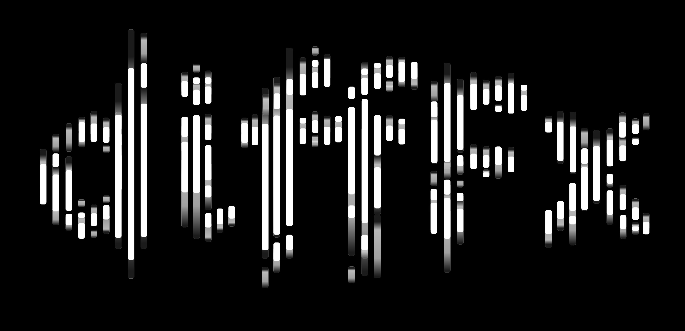

# DiffFx


**A PyTorch-based library for differentiable audio effects processing.**


[](https://difffx-pytorch.readthedocs.io/en/latest/)


Note: Several excellent libraries already exist, such as [GRAFX](https://github.com/sh-lee97/grafx), [dasp-pytorch](https://github.com/csteinmetz1/dasp-pytorch), [NablAFx](https://arxiv.org/abs/2502.11668), and [torchcomp](https://github.com/DiffAPF/torchcomp). Some of my code is inspired by these libraries, and I'm grateful to their developers for implementing several fundamental processors. My core extension will be developing human-interpretable effect processors, where the parameters of each processor can be easily understood by humans. 


## Overview

**DiffFx** provides a collection of differentiable audio effects processors that can be integrated into neural network architectures. Most implementations follow methods from books including [Audio Effects: Theory, Implementation and Application](https://www.routledge.com/Audio-Effects-Theory-Implementation-and-Application/Reiss-McPherson/p/book/9781466560284?srsltid=AfmBOoojCHLTDV-4Yhh6U56cVwTQl2isUgl1KdVKsGFtGVwH2eAQbFnQ) and  [DAFX - Digital Audio Effects (Second Edition)](https://www.dafx.de/DAFX_Book_Page_2nd_edition/index.html)


## Installation
(Not yet supported, will update soon)

```bash
pip install diffFx-pytorch
```

or 

```bash
git clone https://github.com/ytsrt66589/diffFx-pytorch.git
cd diffFx-pytorch
pip install -e .
```

## Quick Start

You can control each processor using either ```dsp_params``` or ```nn_params```. ```dsp_params``` represents the exact DSP parameters used for each processor, while ```nn_params``` contains normalized parameters ranging from 0 to 1 that are internally mapped to the desired DSP parameters by each processor. ```dsp_params``` offers precise manual control over each processor, while ```nn_params``` provides learnable control for neural networks.

### Using DSP Params 
```python
import torch
from diffFx_pytorch.processors.dynamics import Compressor

# Create a compressor
compressor = Compressor(sample_rate=44100)

# Process audio with direct DSP parameters
output = compressor(input_audio, dsp_params={
    'threshold_db': -20.0,
    'ratio': 4.0,
    'knee_db': 6.0,
    'attack_ms': 5.0,
    'release_ms': 50.0,
    'makeup_db': 0.0
})
```

### Neural Network Integration

The library supports deep learning integration through normalized parameters:

```python
import torch
import torch.nn as nn
from diffFx_pytorch.processors.dynamics import Compressor

# Create a neural network controller
class CompressorNet(nn.Module):
    def __init__(self, input_size, num_params):
        super().__init__()
        self.net = nn.Sequential(
            nn.Linear(input_size, 32),
            nn.ReLU(),
            nn.Linear(32, num_params),
            nn.Sigmoid()  # Output in range [0,1]
        )
    
    def forward(self, x):
        return self.net(x)

# Initialize processor and network
comp = Compressor(sample_rate=44100)
num_params = comp.count_num_parameters()
controller = CompressorNet(input_size=16, num_params=num_params)

# Process audio with predicted parameters
features = torch.randn(batch_size, 16)
norm_params = controller(features)
output = comp(input_audio, nn_params=norm_params)
```


## Examples 

### Understanding the sound characteristic of each processor
Check [examples/processors/notebook](examples/processors/notebook) to see how each processor affect sound. 


## Features
### Implemented Effects 🎛️ 
- **Utilities**
  - [] Send 
  - [] Mid/Side Processing 
- **Linear Gain**
  - [x] Gain: [playground](examples/processors/notebook/play_gain.ipynb)
- **EQ** 
  - [x] ToneStack: [playground](examples/processors/notebook/play_tonestack.ipynb)
  - [x] Graphic Equalizer: [playground](examples/processors/notebook/play_geq.ipynb)
  - [x] Parametric Equalizer: [playground](examples/processors/notebook/play_peq.ipynb)
- **Dynamics**
  - [x] Compressor: [playground](examples/processors/notebook/play_comp.ipynb) 
  - [x] Multi-band Compressor: [playground](examples/processors/notebook/play_comp.ipynb) 
  - [x] Limiter: [playground](examples/processors/notebook/play_limiter.ipynb) 
  - [x] Multi-band Limiter: [playground](examples/processors/notebook/play_limiter.ipynb) 
  - [x] Expander: [playground](examples/processors/notebook/play_expander.ipynb) 
  - [] Multi-band Expander
  - [x] Noise Gate: [playground](examples/processors/notebook/play_noisegate.ipynb) 
  - [] Multi-band Noise Gate
  - [] Deesser
- **Delay**
  - [x] Basic Delay: [playground](examples/processors/notebook/play_delay.ipynb)  
  - [x] Feedback Basic Delay: [playground](examples/processors/notebook/play_delay.ipynb) 
  - [x] Slapback Delay: [playground](examples/processors/notebook/play_delay.ipynb) 
  - [x] Ping-pong Delay: [playground](examples/processors/notebook/play_pingpong.ipynb)
  - [x] Multi-taps Delay: [playground](examples/processors/notebook/play_multitap.ipynb)
- **Spatial**
  - [x] Stereo Panning: [playground](examples/processors/notebook/play_pan.ipynb)
  - [x] Stereo Widener: [playground](examples/processors/notebook/play_widener.ipynb)
  - [x] Multi-band Stereo Widener: [playground](examples/processors/notebook/play_mbwidener.ipynb)
  - [x] Stereo Enhancer: [playground](examples/processors/notebook/play_enhancer.ipynb)
- **Modulation**
  - [x] Chorus: [playground](examples/processors/notebook/play_chorus.ipynb)
  - [x] Multi-voice Chorus: [playground](examples/processors/notebook/play_multivoicechorus.ipynb)
  - [x] Stereo Chorus: [playground](examples/processors/notebook/play_stereochorus.ipynb)
  - [x] Flanger: [playground](examples/processors/notebook/play_flanger.ipynb)
  - [x] Feedback Flanger: [playground](examples/processors/notebook/play_fbflanger.ipynb)
  - [x] Stereo Flanger: [playground](examples/processors/notebook/play_stereoflanger.ipynb)
  - [x] Phaser: [playground](examples/processors/notebook/play_phaser.ipynb)
- **Reverb**
  - [x] Noise Shape Reverb: [playground](examples/processors/notebook/play_reverb.ipynb)
  - [] Feedback Delay Network (FDN)
- **Distortion (Nonlinear)**
  - [x] TanH: [playground](examples/processors/notebook/play_distortion.ipynb)
  - [x] Hard/Soft/Double-Soft/Cubic/ArcTanh/Rectifier/Exponential Clipper: [playground](examples/processors/notebook/play_distortion.ipynb)
  - [x] Bit Crusher 


## Contributing

Contributions are welcome! Please feel free to submit a Pull Request. Check the to-do list above for effects that haven't been implemented yet.

## Citation

If you use diffFx-pytorch in your research, please cite:

```bibtex
@software{difffx_pytorch,
  title = {diffFx-pytorch: Differentiable Audio Effects Processing in PyTorch},
  author = {Yen-Tung Yeh},
  year = {2024},
  url = {https://github.com/ytsrt66589/difffx-pytorch}
}
```

## License

This project is licensed under the Apache License - see the [LICENSE](LICENSE) file for details.
